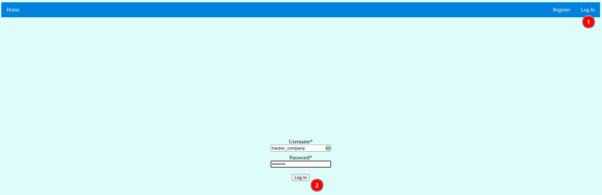
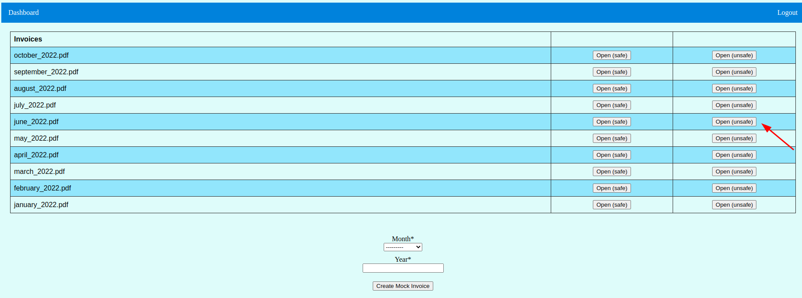
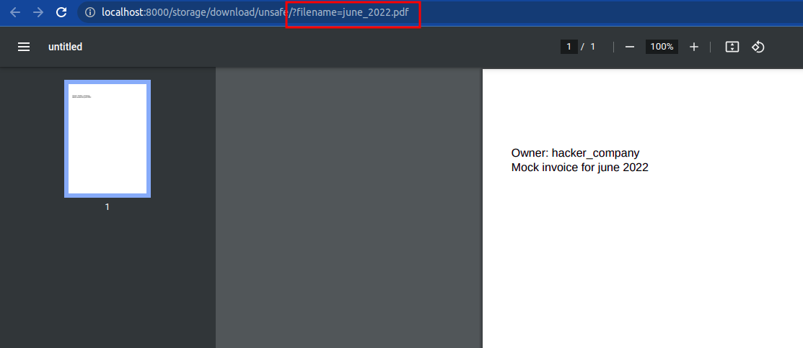
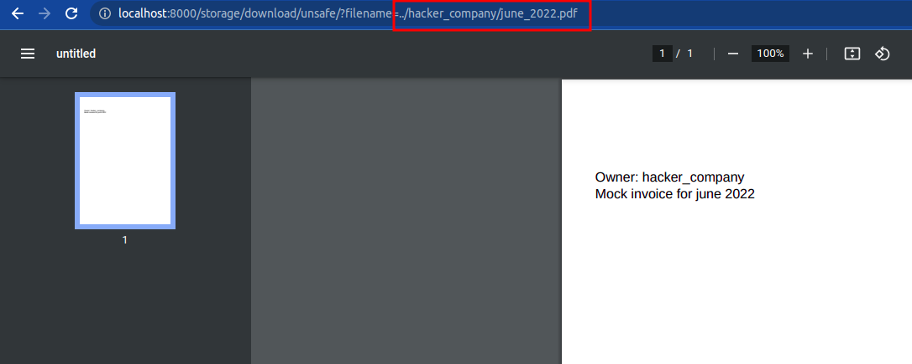
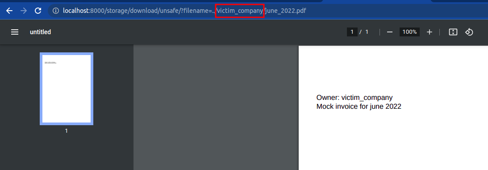
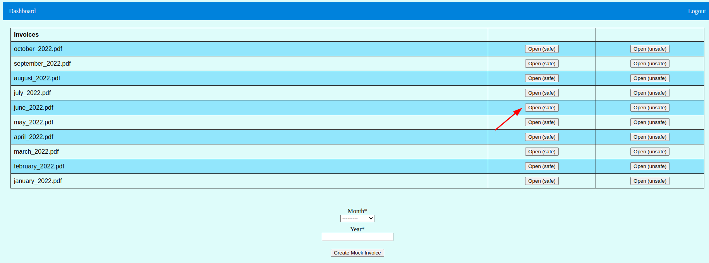
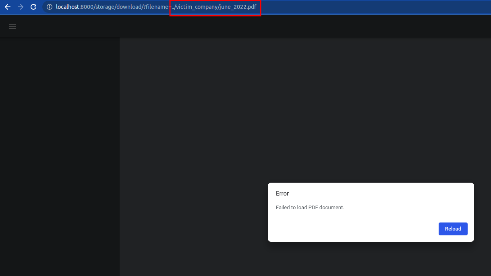

# 1. Introduction
This project is focused on showing one of the basic cybersecurity attack:
path traversal. This project is focused on path traversal, so other
vulnerabilities like not using ssl certificates, etc. are not considered.

# 2. What is path traversal

Path traversal is one of the web-based cyberattacks. It uses vulnerabilities
of web apps which allow users traverse file structure on the server which
they should not have access to. It can cause serious data breach and
confidential file theft.

# 3. Local setup

## 3.1 Requirements
- Docker version 20.10.18
- docker-compose version 1.29.2

Project was developed with these versions of docker, but previous versions
should also work.

## 3.2 Steps

1. Download this repository
2. Run `./bin/build_image` which downloads and builds required docker image(it may
take a moment)
3. Run `./bin/generate_ssh_keys` which creates private/public key pair in
`./ssh` folder. It is required for safe connection to SFTP server
4. Run `./bin/run_app` which builds database, SFTP server and starts whole
application which is database, SFTP and django monolith. It may need rerun 
after first time, because of db building while backend depends on it
5. Run `./bin/load_private_key` to store private key encrypted in database.
It also removes private key file
6. Run `./bin/set_sftp_permissions` to set proper permissions on SFTP docker
volume
7. Run `./bin/load_initial_data` to load demo data. It may take a time as it is
saving files to sftp server

Now app should be accessible at `http://localhost:8000`.

# 4. Demo

Application imitates web page of accounting portal. You can create your 
monthly reports there download them as pdf

## 4.1 Document theft scenario

Login to application with predefined hacker account
(Username: `hacker_company`, Password: `Demo1234!`).


On the dashboard you can see list of your invoices with two buttons: one for 
safe open and one for unsafe open. Click the unsafe for now for any invoice.


Hacker can now see his invoice for June. He also sees path to that file in
url parameters.


The smart hacker will start messing around with this url parameter. He starts
wondering whether he can escape the folder in which file is stored. He assumes
that his invoice file is stored in folder named by his company name. He tries
changing `june_2022.pdf` to `../hacker_company/june_2022.pdf` to check that.
Bingo!


Now all that hacker needs to know to steal someone's document with confidential
data is to know company name which he wants to steal from. He wants to rob
`victim_company` so he tries putting that name in url parameter. Kachoow!


## 4.2 Safe invoice view

Let's see what will happen when hacker try to do the same trick with the safe
view


It now does not work and 404 is returned


# 5 Explanation

## 5.1 So how does it work?

When you look at `path_traversal/storage/views.py` you see that the difference
between `download_file_safe` and `download_file_unsafe` view is that the unsafe
one calls `get_pdf_from_request` with `safe=False` and safe one is calling
the same function without specifying `safe` argument(which defaults to `True`).

Then going deeper in `get_pdf_from_request` we finally call
`_get_pdf_bytes_from_sftp_server` with passed `safe` argument. This argument
defines whether validation of path is run. When `safe` set we check whether
path provided is absolute, does not contain going back in files structure
(`../`) and whether file is pdf file.

```
def _is_path_valid(path):
    return isabs(path) and '../' not in path and path[-4:] == '.pdf'


def _get_pdf_bytes_from_sftp_server(remote_path, safe=True):
    if safe and not _is_path_valid(remote_path):
        return None
        
    ...
```

## 5.1 How path traversal is different from web parameter tampering?

Actually example contains web parameter tampering(wpt), because we perform attack
by changing url parameter. To clarify, changing path to file is wpt, but not
validating the path and allowing user to traverse file structure is definitely
part of path traversal attack.

Comparing to my previous [project about wpt](https://github.com/dev-michal-skiba/web-parameter-tampering-demo),
in this version of the web app, we are not getting file by user reference, but
by its path. App could be written in such way that we download file by its id
(validating that file's owner match to user by token). In such way user would
not be able to manipulate path as path would be taken from database, but for
app example I used more naive way.
